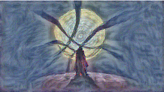

<h1> Neural Style Transfer </h1>

Here I have implemented the paper by Gatys et al. [here](https://arxiv.org/abs/1508.06576) in pytorch.

This is done as a part of the CS231n course assignments.

Blog for further understanding [here](https://medium.com/artists-and-machine-intelligence/neural-artistic-style-transfer-a-comprehensive-look-f54d8649c199)

<h2> Sample image: </h2> 

  
   

